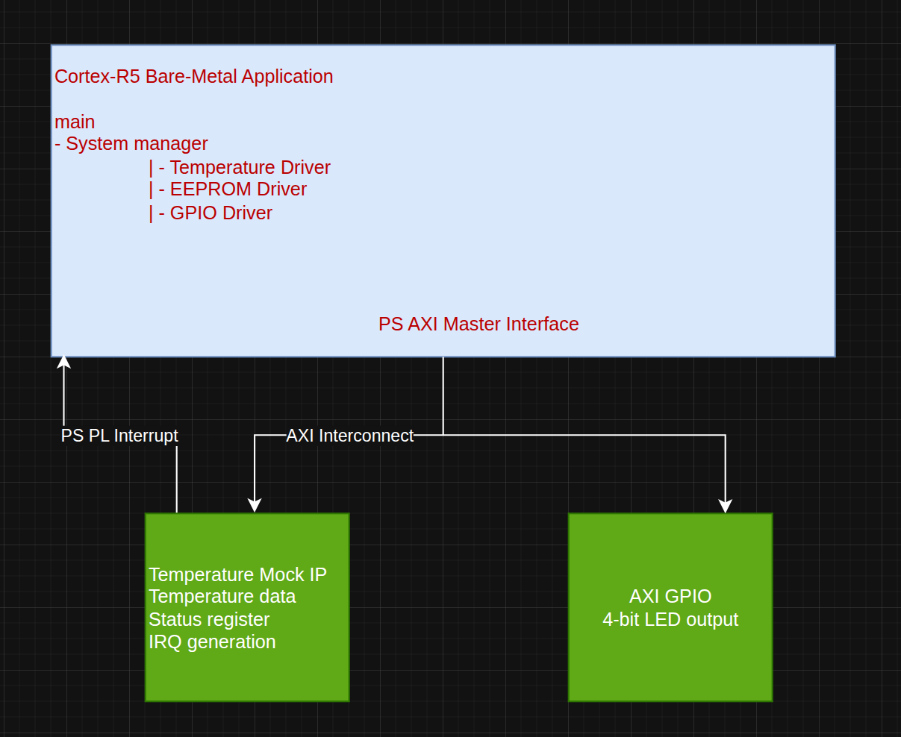

## System Overview
The system is a Zynq UltraScale+ MPSoC–based temperature monitoring application.  
  
The programmable logic generates simulated temperature measurements through a custom AXI4-Lite peripheral. A bare-metal application on the Cortex-R5 processor reads these measurements, receives temperature update interrupts, evaluates configuration data read from EEPROM, and controls four LEDs through an AXI GPIO peripheral.

