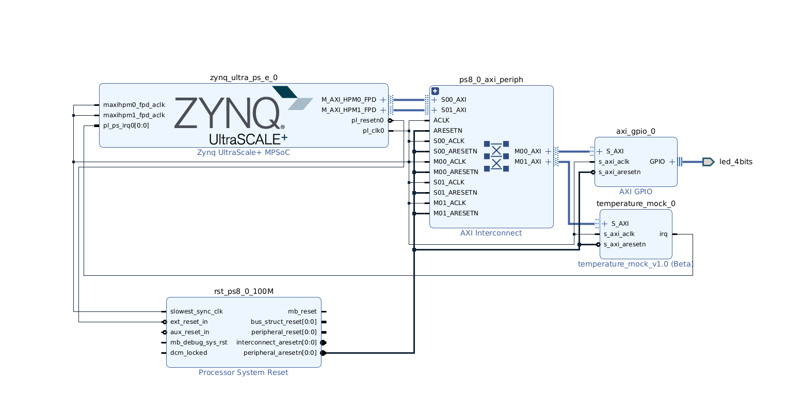

## Hardware Architecture
The Zynq UltraScale+ Processing System provides:

Cortex-R5 processor for running the bare-metal application
AXI master interfaces for accessing programmable-logic peripherals
PL clock generation
PL reset generation
Interrupt controller
Access to the board EEPROM through the selected I²C controller

