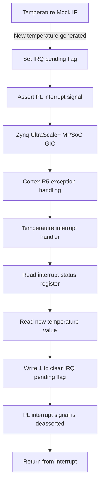

# Interrupt Handling
## Overview 
The temperature-monitoring system uses an interrupt generated by custom temperature_mock IP whenver a new temperature measurement is available. The interrupt is routed from programmable logic to the Cortex-R5 processor through the Zynq UltraScale+ interrupt controller. 

The software interrupt handler acknowledges the interrupt source and infroms the main application that a new temperature measurement is available. The main application then reads the new temperature value from the temperature_mock IP and updates the LED status accordingly.

## Interrupt Generation
The temperature mock UP generates simulated temperature value. After updating temperature registers, the IP sets its internal irq_pending signal.
irq_pending <= '1';  
The interrupt output remains asserted while irq_pending is set.  

This means interrupt signal is level sensitive:
irq_pending = '1' -> interrupt signal asserted
irq_pending = '0' -> interrupt signal deasserted

The interrupt signal is remaining active until software acknowledges it.

How sequence is working:  
- The temperature mock IP generates a new value.
- The IP sets interrupt pending flag to '1'. irq_pending <= '1';
- The interrupt line remains asserted.
- The Cortex-R5 processor enters interrupt handler.
- Software clears the interrupt pending flag by writing '1'. Acknowledge the interrupt source. irq_pending <= '0';
- The interrupt line is deasserted.